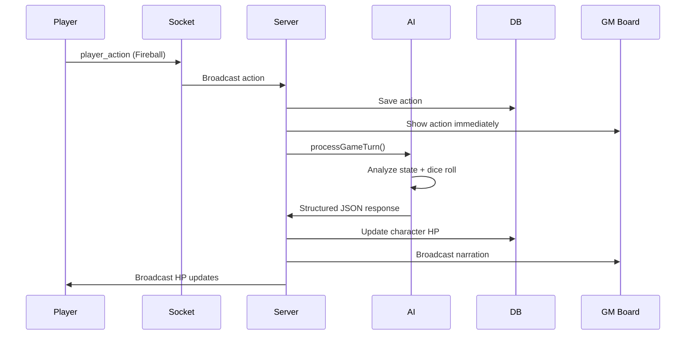

# AI Game Master Integration Guide

## Overview

The AI Game Master uses OpenAI's GPT-4 with structured outputs to provide dramatic, fair, and engaging narration for your TRPG sessions. It automatically processes player actions, calculates outcomes, updates character HP, and generates cinematic descriptions.

## Architecture



## Files

- **AI Service**: `lib/ai-game-master.ts`
- **Server Integration**: `server.ts` (processActionWithAI function)
- **Environment**: `.env.local` (OPENAI_API_KEY)

## Setup

### 1. Get OpenAI API Key

1. Go to [platform.openai.com](https://platform.openai.com)
2. Create an account or sign in
3. Navigate to API Keys
4. Create a new secret key
5. Copy the key (starts with `sk-`)

### 2. Configure Environment

Add to `.env.local`:

```env
OPENAI_API_KEY="sk-your-api-key-here"
```

### 3. Install Dependencies

Already installed:
- `openai` - Official OpenAI SDK
- `zod` - Schema validation for structured outputs

## AI Service API

### processGameTurn()

Main function that processes player actions with AI.

**Parameters**:
```typescript
{
  currentState: {
    currentScene: string
    characters: Array<{
      id: string
      name: string
      hp: number
      maxHp: number
      ac: number
      class: string
      level: number
    }>
    enemies?: Array<{...}>
    environment?: string
    recentEvents?: string[]
  },
  playerAction: {
    actionType: 'attack' | 'skill' | 'item' | 'move' | 'talk' | 'custom'
    actorId: string
    actorName: string
    targetId?: string
    targetName?: string
    skillName?: string
    itemName?: string
    description: string
  }
}
```

**Returns**:
```typescript
{
  narration: string  // Dramatic description of what happens
  hp_updates: Array<{
    target_id: string
    amount: number  // Negative for damage, positive for healing
    reason: string
  }>
  new_scene_prompt?: string  // For generating new background images
  dice_results?: {
    roll: number
    modifier: number
    total: number
    success: boolean
  }
  status_effects?: Array<{
    target_id: string
    effect: string
    duration: number
  }>
}
```

## System Prompt

The AI is instructed to:

1. **Be Dramatic and Engaging**: Create vivid, immersive narration
2. **Be Fair but Challenging**: Balance difficulty appropriately
3. **Follow D&D 5e Rules**: Use standard mechanics
4. **React to Player Actions**: Describe outcomes based on dice rolls
5. **Maintain Consistency**: Keep track of game state
6. **Create Consequences**: Make actions meaningful

**Tone Guidelines**:
- Descriptive, cinematic language
- Build tension and suspense
- Celebrate successes dramatically
- Make failures interesting, not just punishing
- Include sensory details

## Example Flow

### Player Action

```typescript
{
  actionType: 'skill',
  actorId: 'char-1',
  actorName: 'Aragorn',
  targetId: 'orc-1',
  targetName: 'Orc Warrior',
  skillName: 'Fireball',
  description: 'Aragorn casts Fireball at the Orc!'
}
```

### Dice Roll

```typescript
{
  roll: 18,  // d20
  modifier: 5,  // Spellcasting modifier
  total: 23  // Success!
}
```

### AI Response

```json
{
  "narration": "Aragorn's hands crackle with arcane energy as he weaves the ancient words of power. A sphere of roaring flame erupts from his palms, streaking through the air like a miniature sun. The Orc Warrior's eyes widen in terror as the fireball engulfs him in a brilliant explosion of heat and light. The smell of singed fur fills the air as the orc stumbles backward, his armor smoking and blackened.",
  "hp_updates": [
    {
      "target_id": "orc-1",
      "amount": -28,
      "reason": "Fireball damage (8d6)"
    }
  ],
  "dice_results": {
    "roll": 18,
    "modifier": 5,
    "total": 23,
    "success": true
  }
}
```

### Server Processing

1. **Broadcast narration** to all players
2. **Update Orc HP**: 50 → 22
3. **Save to database**
4. **Emit HP update** to clients
5. **Update UI** on GM board and player controllers

## Integration with Socket.io

### Server-Side

```typescript
// When player action is received
socket.on('player_action', async ({ roomId, actionData }, callback) => {
  // Broadcast action immediately
  io.to(roomId).emit('game:action', actionData)
  
  // Process with AI (async, non-blocking)
  processActionWithAI(roomId, actionData, io)
  
  callback({ success: true })
})
```

### processActionWithAI()

1. **Fetch campaign data** from database
2. **Build game state** for AI context
3. **Call AI** with structured output
4. **Broadcast narration** as chat message
5. **Apply HP updates** to database
6. **Emit updates** to all clients
7. **Update campaign state** if scene changes

## Customization

### Adjusting AI Behavior

Edit `SYSTEM_PROMPT` in `lib/ai-game-master.ts`:

```typescript
const SYSTEM_PROMPT = `You are an expert Dungeon Master...

**Custom Rules**:
- Use Pathfinder 2e mechanics instead of D&D 5e
- Be more lenient with critical failures
- Emphasize horror elements

...`
```

### Changing Dice Modifiers

Edit `rollDice()` function:

```typescript
function rollDice(actionType: string) {
  const roll = Math.floor(Math.random() * 20) + 1
  
  let modifier = 0
  switch (actionType) {
    case 'attack':
      modifier = 7  // Higher strength modifier
      break
    case 'skill':
      modifier = 5  // Higher spellcasting
      break
    // ...
  }
  
  return { roll, modifier, total: roll + modifier }
}
```

### Adding Custom Response Fields

Extend `GameMasterResponseSchema`:

```typescript
const GameMasterResponseSchema = z.object({
  narration: z.string(),
  hp_updates: z.array(...),
  // Add custom fields
  loot_dropped: z.array(z.string()).optional(),
  experience_gained: z.number().optional(),
  quest_progress: z.object({
    quest_id: z.string(),
    progress: z.number(),
  }).optional(),
})
```

## Error Handling

### AI Failures

If OpenAI API fails, the system:
1. Logs error to console
2. Returns fallback response
3. Sends error message to players

```typescript
{
  narration: "The outcome is uncertain...",
  hp_updates: [],
  dice_results: { ... }
}
```

### Network Issues

- Socket.io handles reconnection automatically
- AI processing is async (doesn't block gameplay)
- Players see action immediately, narration follows

## Performance

### Response Time

- **Immediate**: Action broadcast (~10ms)
- **AI Processing**: 1-3 seconds
- **Total**: Players see action instantly, narration arrives shortly after

### Cost Optimization

OpenAI API costs (GPT-4):
- ~$0.01 per action (1000 tokens)
- Typical session (20 actions): ~$0.20
- Monthly (100 sessions): ~$20

**Optimization Tips**:
1. Use GPT-3.5-turbo for lower costs
2. Cache common responses
3. Batch multiple actions
4. Limit context length

## Testing

### Manual Testing

1. **Start server**: `npm run dev`
2. **Open player controller**: `/play/campaign-id`
3. **Perform action**: Tap "Fireball"
4. **Check console**: Look for `[AI GM]` logs
5. **Verify narration**: Should appear in GM board and game log

### Example Test

```bash
# Set API key
export OPENAI_API_KEY="sk-..."

# Start server
npm run dev

# In another terminal, test with curl
curl -X POST http://localhost:3000/api/test-ai \
  -H "Content-Type: application/json" \
  -d '{
    "action": "attack",
    "actor": "Test Player",
    "target": "Goblin"
  }'
```

## Troubleshooting

### "AI processing error"

**Causes**:
- Invalid API key
- Rate limit exceeded
- Network timeout
- Invalid response format

**Solutions**:
1. Check `OPENAI_API_KEY` in `.env.local`
2. Verify API key is active
3. Check OpenAI dashboard for errors
4. Review console logs for details

### Narration not appearing

**Check**:
1. Socket.io connection (green dot)
2. Console for `[AI GM]` logs
3. Database for saved messages
4. Network tab for Socket.io events

### HP not updating

**Check**:
1. Character IDs match in database
2. HP updates in AI response
3. Database update logs
4. Client-side state management

## Advanced Features

### Scene Image Generation

Use DALL-E to generate scene backgrounds:

```typescript
const imageUrl = await generateSceneImage(
  "A dark cave with glowing crystals"
)
```

### Multi-turn Combat

Track initiative and turn order:

```typescript
const gameState = {
  ...state,
  turnOrder: ['char-1', 'orc-1', 'char-2'],
  currentTurn: 'char-1',
  round: 1,
}
```

### Status Effects

Apply conditions like poisoned, blessed:

```typescript
{
  status_effects: [
    {
      target_id: 'char-1',
      effect: 'poisoned',
      duration: 3  // turns
    }
  ]
}
```

## Best Practices

1. **Keep context concise**: Only include relevant recent events
2. **Validate AI responses**: Check for required fields
3. **Handle failures gracefully**: Always have fallback narration
4. **Log everything**: Track AI calls for debugging
5. **Monitor costs**: Set up billing alerts on OpenAI dashboard
6. **Test edge cases**: Empty actions, invalid targets, etc.

## Resources

- [OpenAI API Documentation](https://platform.openai.com/docs)
- [Structured Outputs Guide](https://platform.openai.com/docs/guides/structured-outputs)
- [Zod Schema Documentation](https://zod.dev)
- [D&D 5e SRD](https://dnd.wizards.com/resources/systems-reference-document)
