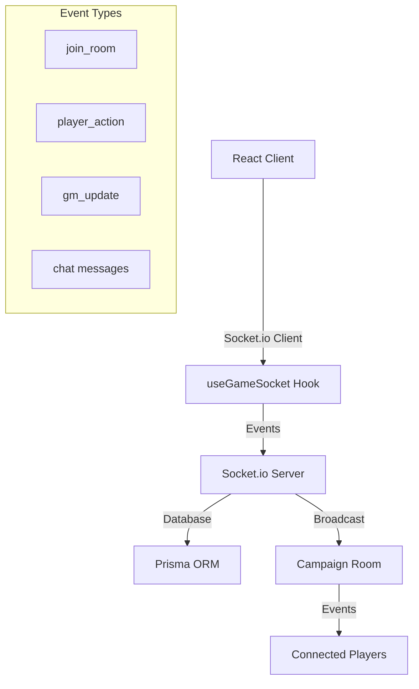
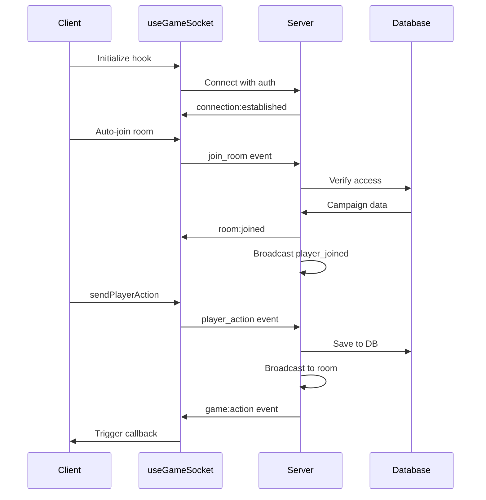

# Socket.io Real-time Communication Guide

## Overview

The AI-TRPG-Platform uses Socket.io for real-time communication between players, game masters, and the server. This guide covers the complete implementation including server setup, type-safe events, and React hooks.

---

## Architecture



---

## File Structure

```
ai-trpg-platform/
├── server.ts                    # Custom Socket.io server
├── types/
│   └── socket.ts               # Type-safe event definitions
├── hooks/
│   └── useGameSocket.ts        # React hook for socket connection
└── components/
    └── GameRoom.tsx            # Example usage component
```

---

## Type-Safe Events

### Event Interfaces

All socket events are fully typed for compile-time safety:

#### Server to Client Events
- `room:joined` - User successfully joined a room
- `room:left` - User left the room
- `room:player_joined` - Another player joined
- `room:player_left` - Another player left
- `game:action` - Player performed an action
- `game:state_update` - GM updated game state
- `game:turn_change` - Turn order changed
- `chat:message` - New chat message
- `chat:typing` - Typing indicator
- `error` - Error occurred
- `connection:established` - Initial connection
- `connection:reconnected` - Reconnected after disconnect

#### Client to Server Events
- `join_room` - Join a campaign room
- `leave_room` - Leave current room
- `player_action` - Send player action
- `gm_update` - Update game state (GM only)
- `chat:send` - Send chat message
- `chat:typing` - Send typing indicator
- `ping` - Measure latency

---

## Server Implementation

### Starting the Server

The custom server ([server.ts](file:///c:/Users/tpune/OneDrive/Desktop/RNRMobile/ai-trpg-platform/server.ts)) integrates Socket.io with Next.js:

```bash
# Development (with hot reload)
npm run dev

# Production
npm run build
npm start
```

### Key Features

#### 1. Authentication Middleware

```typescript
io.use(async (socket, next) => {
  const userId = socket.handshake.auth.userId
  const userName = socket.handshake.auth.userName
  const userRole = socket.handshake.auth.userRole

  if (!userId || !userName) {
    return next(new Error('Authentication required'))
  }

  socket.data.userId = userId
  socket.data.userName = userName
  socket.data.userRole = userRole
  next()
})
```

#### 2. Room Management

- **Automatic room creation**: Rooms are created when first player joins
- **Access control**: Verifies user is GM or player in campaign
- **Player tracking**: Maintains list of connected players per room
- **Cleanup**: Removes empty rooms automatically

#### 3. Database Integration

All events are persisted to PostgreSQL via Prisma:
- Chat messages saved to `ChatMessage` table
- Game state updates saved to `Campaign.currentState`
- Player actions optionally saved as chat messages

#### 4. Error Handling

- Connection timeouts (60s)
- Reconnection attempts (5 max)
- Graceful disconnection cleanup
- Error events sent to clients

---

## React Hook Usage

### Basic Setup

```typescript
import { useGameSocket } from '@/hooks/useGameSocket'

const {
  isConnected,
  isInRoom,
  roomInfo,
  sendPlayerAction,
  sendChatMessage,
  onPlayerAction,
  onChatMessage,
} = useGameSocket(campaignId, {
  userProfile: {
    id: user.id,
    name: user.name,
    role: user.role,
    characterId: character?.id,
    characterName: character?.name,
  },
  autoConnect: true,
  onError: (error) => console.error(error),
  onReconnect: () => console.log('Reconnected!'),
})
```

### Hook API

#### Connection State
- `socket` - Raw Socket.io instance
- `isConnected` - Connection status
- `isInRoom` - Whether user is in a room
- `roomInfo` - Current room information
- `connectionError` - Last error message
- `latency` - Round-trip time in ms

#### Room Actions
- `joinRoom(roomId)` - Join a specific room
- `leaveRoom()` - Leave current room

#### Game Actions
- `sendPlayerAction(actionData)` - Send player action
- `sendGMUpdate(gameState)` - Update game state (GM only)

#### Chat Actions
- `sendChatMessage(content, type)` - Send message
- `sendTypingIndicator(isTyping)` - Send typing status

#### Event Listeners
- `onPlayerAction(callback)` - Listen for actions
- `onGameStateUpdate(callback)` - Listen for state updates
- `onChatMessage(callback)` - Listen for messages
- `onPlayerJoined(callback)` - Listen for joins
- `onPlayerLeft(callback)` - Listen for leaves
- `onTyping(callback)` - Listen for typing

#### Utilities
- `measureLatency()` - Ping server
- `reconnect()` - Manual reconnect
- `disconnect()` - Manual disconnect

---

## Event Examples

### 1. Join Room

**Client**:
```typescript
const result = await joinRoom('campaign-uuid')
if (result.success) {
  console.log('Joined successfully!')
}
```

**Server Response**:
```typescript
socket.emit('room:joined', {
  roomInfo: {
    roomId: 'campaign-uuid',
    campaignTitle: 'Dragon's Lair',
    connectedPlayers: [...],
    gmId: 'gm-uuid'
  },
  userProfile: {...}
})
```

### 2. Player Action

**Client**:
```typescript
await sendPlayerAction({
  actionType: 'attack',
  actorId: character.id,
  actorName: 'Aragorn',
  targetId: 'orc-1',
  targetName: 'Orc Warrior',
  damage: 15,
  description: 'Aragorn swings his sword at the Orc!'
})
```

**Broadcast to Room**:
```typescript
io.to(roomId).emit('game:action', actionData)
```

### 3. GM Update

**Client (GM only)**:
```typescript
await sendGMUpdate({
  currentScene: 'Dark Forest',
  gameTime: { day: 1, hour: 14, season: 'Spring' },
  weather: 'Rainy',
  turnOrder: ['char-1', 'char-2', 'char-3'],
  currentTurn: 'char-1'
})
```

**Broadcast to Room**:
```typescript
io.to(roomId).emit('game:state_update', gameState)
io.to(roomId).emit('game:turn_change', {
  currentTurn: 'char-1',
  turnOrder: ['char-1', 'char-2', 'char-3']
})
```

### 4. Chat Message

**Client**:
```typescript
await sendChatMessage('Hello everyone!', MessageType.TALK)
```

**Saved to Database & Broadcast**:
```typescript
const message = await prisma.chatMessage.create({...})
io.to(roomId).emit('chat:message', {
  id: message.id,
  content: message.content,
  type: message.type,
  senderId: message.senderId,
  senderName: message.senderName,
  timestamp: message.createdAt
})
```

---

## Connection Flow



---

## Error Handling

### Connection Errors

```typescript
useGameSocket(campaignId, {
  userProfile,
  onError: (error) => {
    switch (error.code) {
      case 'AUTH_FAILED':
        // Redirect to login
        break
      case 'ROOM_NOT_FOUND':
        // Show error message
        break
      case 'ACCESS_DENIED':
        // Redirect to campaigns list
        break
      default:
        // Generic error handling
    }
  }
})
```

### Reconnection

The hook automatically handles reconnection:
- 5 retry attempts
- Exponential backoff (1s to 5s)
- Auto-rejoin room on reconnect
- `onReconnect` callback for UI updates

### Graceful Degradation

```typescript
if (!isConnected) {
  return <div>Connecting to server...</div>
}

if (connectionError) {
  return (
    <div>
      <p>Connection error: {connectionError}</p>
      <button onClick={reconnect}>Retry</button>
    </div>
  )
}
```

---

## Performance Optimization

### 1. Latency Monitoring

```typescript
useEffect(() => {
  const interval = setInterval(async () => {
    const latency = await measureLatency()
    if (latency > 500) {
      console.warn('High latency detected:', latency)
    }
  }, 10000)
  return () => clearInterval(interval)
}, [measureLatency])
```

### 2. Message Batching

For high-frequency updates (e.g., character movement):

```typescript
const [pendingUpdates, setPendingUpdates] = useState([])

useEffect(() => {
  if (pendingUpdates.length === 0) return
  
  const timeout = setTimeout(() => {
    sendPlayerAction({
      actionType: 'move',
      // Batch all pending updates
      metadata: { positions: pendingUpdates }
    })
    setPendingUpdates([])
  }, 100) // Batch every 100ms
  
  return () => clearTimeout(timeout)
}, [pendingUpdates])
```

### 3. Room Cleanup

Server automatically cleans up:
- Empty rooms deleted from memory
- Disconnected users removed after timeout
- Stale connections pruned

---

## Security Considerations

### 1. Authentication

Currently uses basic auth from handshake. For production:

```typescript
// Add JWT verification
io.use(async (socket, next) => {
  const token = socket.handshake.auth.token
  try {
    const decoded = await verifyJWT(token)
    socket.data.userId = decoded.userId
    next()
  } catch (error) {
    next(new Error('Invalid token'))
  }
})
```

### 2. Authorization

Server verifies:
- User is GM or player in campaign
- GM-only actions (state updates)
- Rate limiting (TODO)

### 3. Input Validation

All event data should be validated:

```typescript
import { z } from 'zod'

const playerActionSchema = z.object({
  actionType: z.enum(['attack', 'skill', 'move', 'item', 'talk', 'custom']),
  actorId: z.string().uuid(),
  description: z.string().max(1000),
  // ...
})

socket.on('player_action', async ({ roomId, actionData }, callback) => {
  try {
    const validated = playerActionSchema.parse(actionData)
    // Process action...
  } catch (error) {
    callback({ success: false, error: 'Invalid action data' })
  }
})
```

---

## Testing

### Manual Testing

1. **Start the server**:
   ```bash
   npm run dev
   ```

2. **Open multiple browser tabs** to simulate multiple players

3. **Test scenarios**:
   - Join same campaign from multiple tabs
   - Send messages and verify all tabs receive them
   - Disconnect one tab and verify others are notified
   - Test GM-only actions

### Automated Testing (TODO)

```typescript
// Example with socket.io-client
import { io } from 'socket.io-client'

describe('Socket.io Server', () => {
  let clientSocket

  beforeAll((done) => {
    clientSocket = io('http://localhost:3000', {
      auth: { userId: 'test-user', userName: 'Test' }
    })
    clientSocket.on('connect', done)
  })

  afterAll(() => {
    clientSocket.disconnect()
  })

  test('should join room', (done) => {
    clientSocket.emit('join_room', {
      roomId: 'test-campaign',
      userProfile: {...}
    }, (response) => {
      expect(response.success).toBe(true)
      done()
    })
  })
})
```

---

## Next Steps

1. **Add rate limiting** to prevent spam
2. **Implement presence system** (online/away/offline)
3. **Add voice chat integration** (WebRTC)
4. **Implement dice rolling** with server-side verification
5. **Add combat system** with turn management
6. **Create admin dashboard** for monitoring connections

---

## Troubleshooting

### Issue: "Authentication required" error

**Solution**: Ensure userProfile is passed to useGameSocket:
```typescript
useGameSocket(campaignId, {
  userProfile: {
    id: user.id,
    name: user.name,
    role: user.role
  }
})
```

### Issue: Messages not received

**Solution**: Check if socket is in the room:
```typescript
console.log('Is in room:', isInRoom)
console.log('Room info:', roomInfo)
```

### Issue: High latency

**Solution**: 
- Check network connection
- Verify server location
- Consider using Socket.io Redis adapter for scaling

### Issue: Disconnections

**Solution**:
- Increase timeout values in server config
- Check firewall/proxy settings
- Implement heartbeat mechanism

---

## Resources

- [Socket.io Documentation](https://socket.io/docs/)
- [Next.js Custom Server](https://nextjs.org/docs/advanced-features/custom-server)
- [Prisma Documentation](https://www.prisma.io/docs/)
- [TypeScript Handbook](https://www.typescriptlang.org/docs/)
